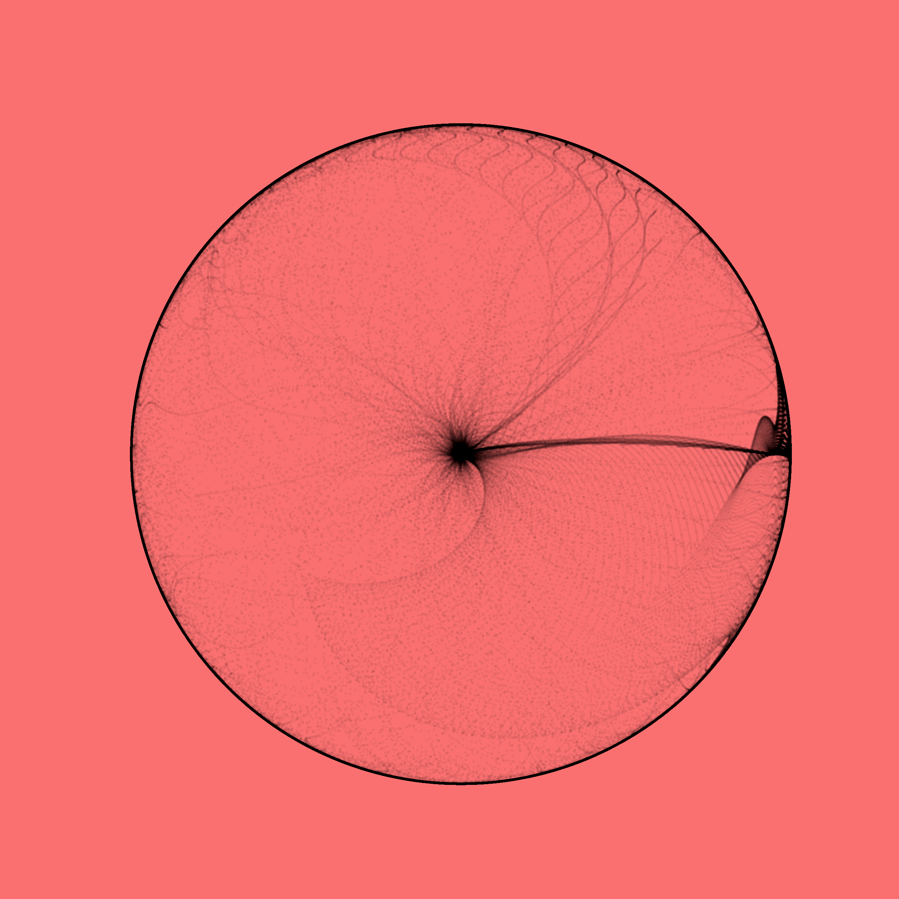

# maige
Maige is a package to generate images using mathematical functions, written in pure python. It uses numpy and matplotlib to create images and animations for different formulae. A user can provide their own functions that they would like to plot or use the inbuilt random function generator to generate outputs. A random algebraic function is generated using an Expression Tree that uses various functions provided by numpy. The user can also provide a set of points that they want to plot, instead of using the default set of points. Since the library is built on matplotlib, it can project the output in any projection that is accepted by `matplotlib`.

## Usage
### Basic Usage

``` python
from maige.generator import Generator
g = Generator()
g.generate_image()
```


### Projection

``` python
from maige.generator import Generator
g = Generator(projection="rectilinear")
g.generate_image()
```


### Custom Function

``` python
from maige.generator import Generator
xfunc = lambda X, Y: X**2 * np.sin(Y**2)
yfunc = lambda X, Y: Y**3 - np.cos(X**2)
g = Generator(
    projection="rectilinear",
    xfunc=xfunc,
    yfunc=yfunc,
)
fig, ax = g.generate_image("./examples/custom_func.png")
```

### Custom Range

``` python
xfunc = lambda X, Y: X**2 * np.sin(Y**2)
yfunc = lambda X, Y: Y**3 - np.cos(X**2)
xrange = np.arange(0, np.pi, 0.01)
yrange = np.arange(0, np.pi, 0.01)
g = Generator(
    projection="polar",
    xfunc=xfunc,
    yfunc=yfunc,
    xrange=xrange,
    yrange=yrange,
)
fig, ax = g.generate_image("./examples/custom_range.png")
```


### Color

``` python
g = Generator(
    pointcolor="#000000",
    background="#FA7070",
    projection="polar",
)
fig, ax = g.generate_image("./examples/custom_color.png")
```


### Animation

``` python
xfunc = lambda X, Y: X**2 * np.sin(Y**2)
yfunc = lambda X, Y: Y**3 - np.cos(X**2)
xrange = np.arange(0, np.pi, 0.01)
yrange = np.arange(0, np.pi, 0.01)
g = Generator(
    pointcolor="#ffffff",
    background="#000000",
    projection="polar",
    xfunc=xfunc,
    yfunc=yfunc,
)
g.generate_animation("./examples/anim_example.gif", init_cond="uniform")
```


### Reproducibility
